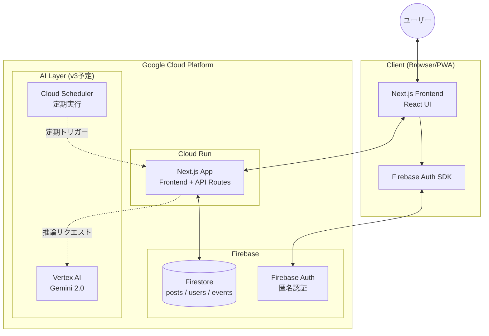
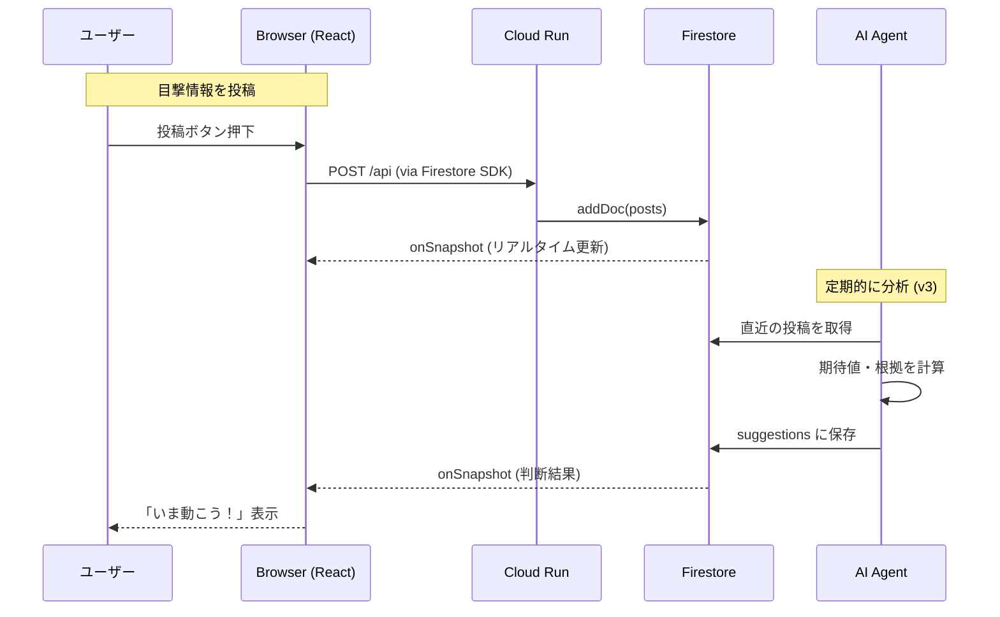
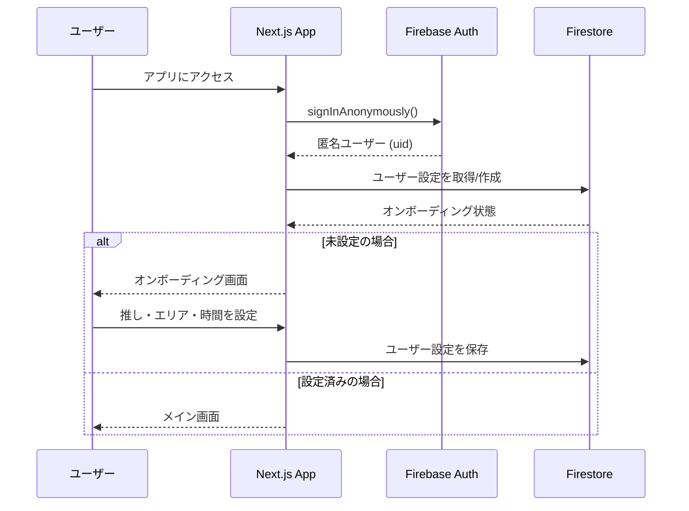
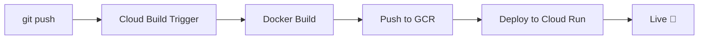
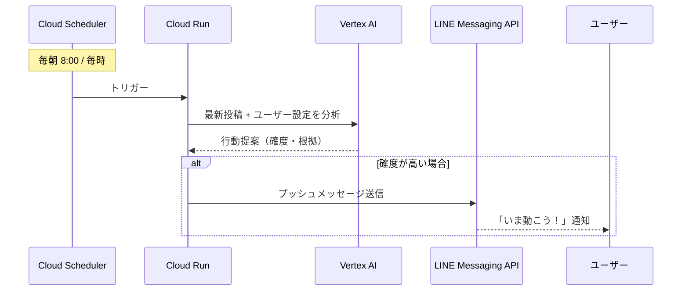

# 💖 Tsugi no Tokimeki - 次のトキメキ

> **「次のトキメキを逃さないための、行動判断エージェント」**
>
> AI駆動型・リアルタイム目撃情報共有 & 行動提案アプリケーション


## 📖 プロジェクト概要

**Tsugi no Tokimeki** は、推しキャラグッズ（ガチャ・シール等）の目撃情報をリアルタイムで共有し、AIが「今動くべきか」を判断してユーザーに提案するWebアプリケーションです。

- 📍 コミュニティからの目撃情報をリアルタイム収集
- 🤖 AI（将来的にVertex AI/Gemini）による行動判断
- 📅 ユーザーの空き時間 × イベント情報のマッチング
- 🔔 最適なタイミングでの通知（v3予定）

---

## ✨ 主な機能

| 機能 | 説明 | 状態 |
|------|------|------|
| **オンボーディング** | 推しキャラ・エリア・空き時間の設定 | ✅ 実装済み |
| **投稿機能** | 目撃情報（見た/買えた/売り切れ）の投稿 | ✅ 実装済み |
| **フィード表示** | コミュニティ投稿のリアルタイム表示 | ✅ 実装済み |
| **行動判断 AI** | 今動くべきかの判断と根拠表示 | ⚠️ モック実装 |
| **カレンダー連携** | 行ける候補日の表示 | ⚠️ モック実装 |
| **Vertex AI 統合** | 本格的なAI推論 | ❌ 未実装 |
| **LINE通知** | LINE Messaging API でプッシュ通知 | ❌ Phase 3 予定 |
| **FCM通知** | Firebase Cloud Messaging | ❌ Phase 3 予定 |

---

## 🛠 システムアーキテクチャ

本アプリケーションは、Next.js (App Router) をベースに構築され、Cloud Run 上での動作を想定しています。



### アーキテクチャの特徴

- **Serverless**: Cloud Run によるフルマネージドなコンテナ実行
- **Realtime**: Firestore の `onSnapshot` によるリアルタイムデータ同期
- **CI/CD**: GitHub + Cloud Build による自動デプロイ
- **型安全**: TypeScript による厳格な型定義

---

## 🔄 ユーザーフロー

### 投稿 → 判断 → 通知 のシーケンス



### 認証フロー



---

## 📁 ディレクトリ構造

```
tsugi-no-tokimeki/
├── src/
│   └── app/
│       ├── page.tsx          # メインアプリ (全UIコンポーネント)
│       ├── layout.tsx        # ルートレイアウト
│       └── globals.css       # グローバルスタイル (Tailwind)
├── docs/
│   └── DEVELOPMENT_ROADMAP.md  # 開発ロードマップ
├── public/                   # 静的アセット
├── Dockerfile                # Cloud Run 用マルチステージビルド
├── .dockerignore             # Docker ビルド除外設定
├── cloudbuild.yaml           # Cloud Build パイプライン設定
├── next.config.ts            # Next.js 設定 (standalone出力)
├── tailwind.config.ts        # Tailwind CSS 設定
├── tsconfig.json             # TypeScript 設定
├── package.json              # 依存関係
└── .env.local                # 環境変数 (Git管理外)
```

---

## 💻 技術スタック

| Category | Technology | Version | Usage |
|:---------|:-----------|:--------|:------|
| **Framework** | Next.js | 16.x | App Router, React Server Components |
| **Language** | TypeScript | 5.x | 型安全な開発 |
| **UI Library** | React | 19.x | コンポーネントアーキテクチャ |
| **Styling** | Tailwind CSS | 4.x | ユーティリティファースト CSS |
| **Database** | Firestore | - | NoSQL リアルタイムDB |
| **Auth** | Firebase Auth | - | 匿名認証 |
| **Icons** | Lucide React | - | SVG アイコン |
| **Hosting** | Cloud Run | - | コンテナホスティング |
| **CI/CD** | Cloud Build | - | GitHub連携自動デプロイ |
| **Container** | Docker | - | マルチステージビルド |

---

## 📊 開発進捗

### Phase 1: MVP ✅ 完了

- [x] Next.js プロジェクト作成
- [x] Firebase Auth (匿名認証) 設定
- [x] Firestore 連携 & セキュリティルール設定
- [x] オンボーディング UI
- [x] 投稿・フィード機能
- [x] モック AI 判断ロジック
- [x] Docker 設定 (Dockerfile, .dockerignore)
- [x] Cloud Run デプロイ設定
- [x] Cloud Build トリガー設定 (GitHub連携)
- [x] 環境変数設定 (Cloud Build Substitutions)
- [x] API キー制限 (HTTP Referrer)

### Phase 2: バックエンド強化 🔄 次フェーズ

- [ ] Vertex AI (Gemini 2.0) 連携
- [ ] Route Handlers (API エンドポイント)
- [ ] 転売対策 (posts_private コレクション)
- [ ] Edge Functions 最適化

### Phase 3: v3 完全版 📅 予定

- [ ] Cloud Scheduler 定期実行
- [ ] Event Matcher (イベント情報との連携)
- [ ] **LINE Messaging API 連携** ← 📱
- [ ] FCM プッシュ通知
- [ ] PWA 対応

---

## 🚀 ローカルでの実行方法

### 1. 前提条件

- Node.js v20 or later
- npm
- Firebase プロジェクト (Firestore, Auth 有効化済み)

### 2. インストール

```bash
git clone https://github.com/nekoai-lab/tsugi-no-tokimeki.git
cd tsugi-no-tokimeki
npm install
```

### 3. 環境変数の設定

`.env.local` ファイルを作成：

```env
# Firebase Configuration
NEXT_PUBLIC_FIREBASE_API_KEY=your_api_key
NEXT_PUBLIC_FIREBASE_AUTH_DOMAIN=your_project.firebaseapp.com
NEXT_PUBLIC_FIREBASE_PROJECT_ID=your_project_id
NEXT_PUBLIC_FIREBASE_STORAGE_BUCKET=your_project.firebasestorage.app
NEXT_PUBLIC_FIREBASE_MESSAGING_SENDER_ID=your_sender_id
NEXT_PUBLIC_FIREBASE_APP_ID=your_app_id
```

### 4. 実行

```bash
npm run dev
```

http://localhost:3000 にアクセス

---

## ☁️ デプロイ

### Cloud Run へのデプロイ

GitHub への push で自動デプロイされます（Cloud Build トリガー設定済み）

```bash
git add .
git commit -m "feat: new feature"
git push origin main
```

### デプロイパイプライン



### 環境変数 (Cloud Build)

Cloud Build トリガーの「代入変数」で設定：

| 変数名 | 説明 |
|--------|------|
| `_NEXT_PUBLIC_FIREBASE_API_KEY` | Firebase API キー |
| `_NEXT_PUBLIC_FIREBASE_AUTH_DOMAIN` | Firebase Auth ドメイン |
| `_NEXT_PUBLIC_FIREBASE_PROJECT_ID` | Firebase プロジェクト ID |
| `_NEXT_PUBLIC_FIREBASE_STORAGE_BUCKET` | Firebase Storage バケット |
| `_NEXT_PUBLIC_FIREBASE_MESSAGING_SENDER_ID` | Firebase Sender ID |
| `_NEXT_PUBLIC_FIREBASE_APP_ID` | Firebase App ID |

---

## 🔒 セキュリティ

### API キー制限

Firebase API キーには HTTP Referrer 制限を設定済み：

- `localhost:*` (ローカル開発)
- `127.0.0.1:*` (ローカル開発)
- `https://*.run.app/*` (Cloud Run)

### Firestore セキュリティルール

```javascript
rules_version = '2';
service cloud.firestore {
  match /databases/{database}/documents {
    match /{document=**} {
      allow read, write: if request.auth != null;
    }
  }
}
```

---

## 📱 LINE連携（Phase 3 予定）

v3では **LINE Messaging API** を使用したプッシュ通知を実装予定です。

### 通知シナリオ



### 実装予定の機能

| 機能 | 説明 |
|------|------|
| **リッチメッセージ** | 目撃場所・残り個数をカード形式で通知 |
| **クイックリプライ** | 「行く」「スキップ」をワンタップで回答 |
| **リマインダー** | 設定した空き時間の前日に通知 |
| **フォローアップ** | 「買えた？」の確認と自動投稿 |

### LINE連携の設定（予定）

```env
# LINE Messaging API
LINE_CHANNEL_ACCESS_TOKEN=your_channel_access_token
LINE_CHANNEL_SECRET=your_channel_secret
```

---

## 🛡️ License & Credit

- **Development**: nekoai-lab
- **Powered by**: Google Gemini Code Assistant
- **License**: MIT

---

*Created with 💖 by nekoai-lab*
