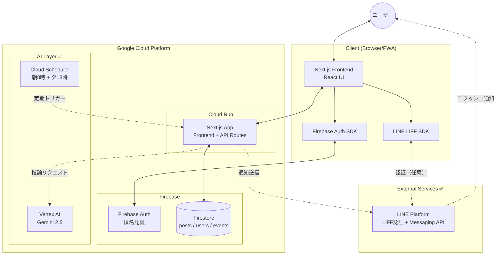
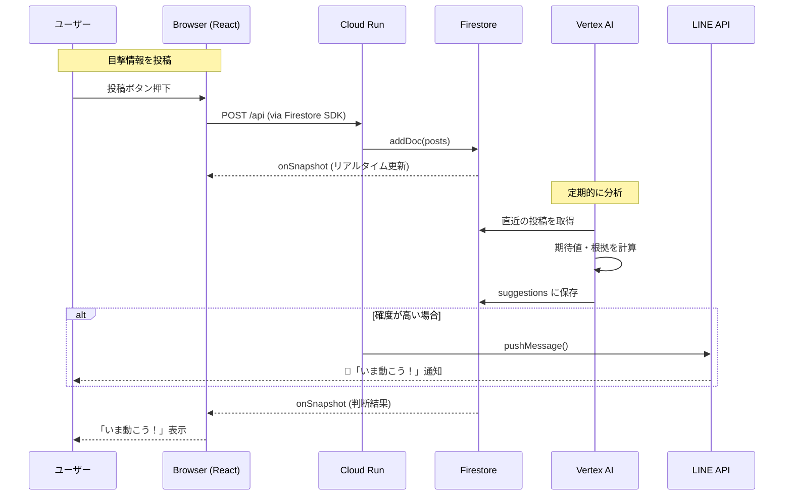
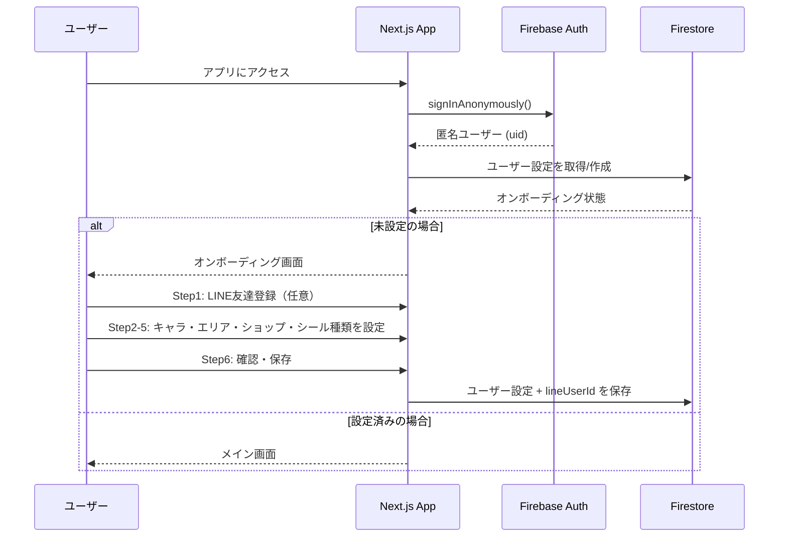
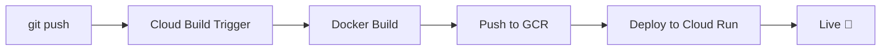
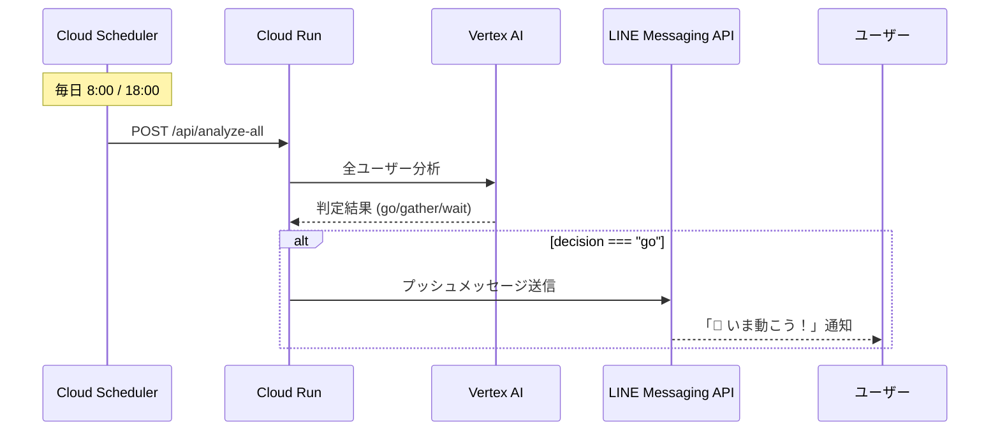

# 💖 Tsugi no Tokimeki - 次のトキメキ

> **「次のトキメキを逃さないための、行動判断エージェント」**
>
> AI駆動型・リアルタイム目撃情報共有 & 行動提案アプリケーション


## 📖 プロジェクト概要

**Tsugi no Tokimeki** は、お気に入りのキャラグッズ（シール）の目撃情報をリアルタイムで共有し、AIがシールを見に行くスケジュールを立ててユーザーに提案するWebアプリケーションです。

- 📍 コミュニティからの目撃情報をリアルタイム収集
- 🤖 **Vertex AI (Gemini 2.5)** による行動判断 ✅
- ⏰ **Cloud Scheduler** で朝8時・夕18時に自動分析、毎朝9時にルート自動生成 ✅
- 📅 ユーザーの空き時間 × イベント情報のマッチング
- 🔔 **LINE通知** でプッシュ通知 ✅

---

## 🎯 解決する課題

### 背景：平成女児ブームとシール入手困難

2025年、**平成女児ブーム**の影響でシール帳文化が再来。しかし需要の急増により：

- 🏃 入荷情報が流れると店舗に人が殺到
- 📱 SNSに張り付いて情報収集する日々
- 😰 店舗側も問い合わせ対応に追われる
- 💸 転売による価格高騰

### 私たちの解決策

**「シールを探しに行く1日を楽しむ」** ためのエージェントを開発。

- ✅ AIが最適な行動スケジュールを提案
- ✅ 自分の興味（キャラ・エリア）に絞った情報だけを表示
- ✅ LINE通知で必要な情報だけをプッシュ

---

## 👥 対象ユーザー

- シール帳作りを楽しみたい人
- 情報収集や行動判断が苦手な人
- 平成女児文化・キャラクターグッズ界隈のファン

---

## ✨ 主な機能

| 機能 | 説明 | 状態 |
|------|------|------|
| **オンボーディング** | キャラ・エリア・ショップ・シール種類・時間指定・LINE通知の設定（7ステップ） | ✅ 実装済み |
| **投稿機能** | 目撃情報（見た/買えた/売り切れ）の投稿 | ✅ 実装済み |
| **フィード表示** | コミュニティ投稿のリアルタイム表示・フィルター機能・いいね機能 | ✅ 実装済み |
| **行動判断 AI** | 今動くべきかの判断と根拠表示（For You画面） | ✅ 実装済み |
| **Vertex AI 統合** | Gemini 2.5 Flash による本格的なAI推論 | ✅ 実装済み |
| **Cloud Scheduler** | 朝8時+夕18時の定期分析、毎朝9時の自動ルート生成 | ✅ 実装済み |
| **ルート提案 AI** | AIがショップ巡回スケジュールを作成 | ✅ 実装済み |
| **ルート再生成** | AIとチャット形式でルートを修正・再提案 | ✅ 実装済み |
| **カレンダー** | ルート提案の一覧表示・詳細確認・確定 | ✅ 実装済み |
| **シールアルバム** | シール帳の写真を投稿・共有 | ✅ 実装済み |
| **プロフィール編集** | ユーザー設定の編集機能（時間設定含む） | ✅ 実装済み |
| **通知設定** | LINE通知のオン/オフ設定 | ✅ 実装済み |
| **LINE連携** | LIFF ログイン + Messaging API でプッシュ通知 | ✅ 実装済み |

---

## 🛠 システムアーキテクチャ

本アプリケーションは、Next.js (App Router) をベースに構築され、Cloud Run 上での動作を想定しています。



### アーキテクチャの特徴

- **Serverless**: Cloud Run によるフルマネージドなコンテナ実行
- **Realtime**: Firestore の `onSnapshot` によるリアルタイムデータ同期
- **CI/CD**: GitHub + Cloud Build による自動デプロイ
- **型安全**: TypeScript による厳格な型定義

---

## 🔄 ユーザーフロー

### 投稿 → 判断 → 通知 のシーケンス



### 認証フロー



---

## 📁 ディレクトリ構造

```
tsugi-no-tokimeki/
├── app/
│   ├── layout.tsx            # ルートレイアウト (AppProvider)
│   ├── page.tsx              # ルートページ (リダイレクト処理)
│   ├── globals.css           # グローバルスタイル (Tailwind)
│   ├── (main)/               # ルートグループ (メインアプリ)
│   │   ├── layout.tsx        # メインレイアウト (Header + Nav)
│   │   ├── home/
│   │   │   └── page.tsx      # For You画面 (/home)
│   │   ├── feed/
│   │   │   └── page.tsx      # Feed画面 (/feed)
│   │   ├── calendar/
│   │   │   └── page.tsx      # Calendar画面 (/calendar)
│   │   ├── profile/
│   │   │   └── page.tsx      # Profile画面 (/profile)
│   │   ├── notification-settings/
│   │   │   └── page.tsx      # 通知設定画面 (/notification-settings)
│   │   └── route-result/
│   │       └── [id]/
│   │           └── page.tsx  # ルート結果詳細 (/route-result/[id])
│   ├── onboarding/
│   │   └── page.tsx          # オンボーディング (/onboarding)
│   └── api/
│       ├── analyze/          # 個別ユーザー分析 API
│       │   └── route.ts
│       ├── analyze-all/      # Cloud Scheduler用 全ユーザー分析 API
│       │   └── route.ts
│       ├── generate-daily-routes/  # 毎朝9時の自動ルート生成 API
│       │   └── route.ts
│       ├── notify-post/      # 投稿通知 API
│       │   └── route.ts
│       └── route-proposal/   # ルート提案 AI API
│           └── route.ts
├── components/               # 再利用可能なコンポーネント
│   ├── NavButton.tsx         # ナビゲーションボタン (Link使用)
│   ├── PostModal.tsx         # 投稿モーダル
│   ├── ProfileEditModal.tsx  # プロフィール編集モーダル
│   ├── LineLoginButton.tsx   # LINE ログインボタン
│   ├── RouteDetailView.tsx   # ルート提案詳細表示
│   ├── RouteRegenerateModal.tsx  # ルート再生成モーダル（AIチャット）
│   ├── ImageViewer.tsx       # 画像フルスクリーン表示
│   ├── TimeEditModal.tsx     # 時間編集モーダル
│   ├── StickerAlbumPostModal.tsx  # シールアルバム投稿モーダル
│   ├── RouteProposalModal/   # ルート提案モーダル
│   │   ├── RouteProposalModal.tsx
│   │   └── components/       # ステップUI
│   │       ├── AreasStep.tsx
│   │       ├── DateStep.tsx
│   │       ├── TimeStep.tsx
│   │       ├── ShopsStep.tsx
│   │       ├── StickerTypeStep.tsx
│   │       ├── StickerDesignStep.tsx
│   │       ├── CompleteStep.tsx
│   │       ├── ChatMessage.tsx
│   │       └── LoadingIndicator.tsx
│   └── shared/               # 共通UIコンポーネント
│       ├── ButtonSelect.tsx
│       ├── CustomDatePicker.tsx
│       ├── CustomTimePicker.tsx
│       ├── SelectWithCustom.tsx
│       └── StepButton.tsx
├── contexts/                 # React Context
│   └── AppContext.tsx        # グローバル状態管理
├── hooks/                    # カスタムフック
│   ├── useRouteProposalForm.ts   # ルート提案フォーム状態
│   ├── useRouteProposalChat.ts   # AIチャット履歴管理
│   └── useRouteProposalSteps.ts  # ステップUI制御
├── lib/                      # ユーティリティ・設定
│   ├── firebase.ts           # Firebase初期化（Auth, Firestore, Storage）
│   ├── liff.ts               # LINE LIFF SDK 初期化・操作
│   ├── line.ts               # LINE Messaging API メッセージ構築
│   ├── types.ts              # TypeScript型定義
│   ├── routeProposalTypes.ts # ルート提案の型定義
│   ├── routeProposalService.ts # Firestore CRUD (ルート提案)
│   ├── routeProposalUtils.ts # ルート提案のフォーマット・パース
│   ├── postService.ts        # 投稿のいいね機能
│   ├── stickerAlbumService.ts # シールアルバム投稿サービス
│   └── utils.ts              # ヘルパー関数・定数
├── docs/
│   ├── DEVELOPMENT_ROADMAP.md  # 開発ロードマップ
│   └── CLOUD_SCHEDULER_SETUP.md  # Cloud Scheduler設定ガイド
├── public/                   # 静的アセット
├── Dockerfile                # Cloud Run 用マルチステージビルド
├── .dockerignore             # Docker ビルド除外設定
├── cloudbuild.yaml           # Cloud Build パイプライン設定
├── firebase.json             # Firebase Emulator 設定
├── firestore.rules           # Firestore セキュリティルール
├── storage.rules             # Firebase Storage セキュリティルール
├── next.config.ts            # Next.js 設定 (standalone出力)
├── tsconfig.json             # TypeScript 設定
├── package.json              # 依存関係
├── .env.example              # 環境変数テンプレート
└── .env.local                # 環境変数 (Git管理外)
```

---

## 💻 技術スタック

| Category | Technology | Version | Usage |
|:---------|:-----------|:--------|:------|
| **Framework** | Next.js | 16.x | App Router, React Server Components |
| **Language** | TypeScript | 5.x | 型安全な開発 |
| **UI Library** | React | 19.x | コンポーネントアーキテクチャ |
| **Styling** | Tailwind CSS | 4.x | ユーティリティファースト CSS |
| **Database** | Firestore | - | NoSQL リアルタイムDB |
| **Storage** | Firebase Storage | - | シールアルバム画像保存 |
| **Auth** | Firebase Auth + LINE LIFF | - | 匿名認証 + LINE連携（任意） |
| **Icons** | Lucide React | - | SVG アイコン |
| **Hosting** | Cloud Run | - | コンテナホスティング |
| **CI/CD** | Cloud Build | - | GitHub連携自動デプロイ |
| **Container** | Docker | - | マルチステージビルド |
| **Notification** | LINE Messaging API | - | プッシュ通知 ✅ |
| **AI** | Vertex AI (Gemini) | 2.5 Flash | 行動判断AI・ルート提案 ✅ |
| **Form** | react-hook-form + zod | - | フォームバリデーション |
| **Markdown** | react-markdown + remark-gfm | - | AIレスポンス表示 |

---

## 📊 開発進捗

### Phase 1: MVP ✅ 完了

- [x] Next.js プロジェクト作成
- [x] Firebase Auth (匿名認証) 設定
- [x] Firestore 連携 & セキュリティルール設定
- [x] オンボーディング UI
- [x] 投稿・フィード機能
- [x] モック AI 判断ロジック
- [x] Docker 設定 (Dockerfile, .dockerignore)
- [x] Cloud Run デプロイ設定
- [x] Cloud Build トリガー設定 (GitHub連携)
- [x] 環境変数設定 (Cloud Build Substitutions)
- [x] API キー制限 (HTTP Referrer)

### Phase 2: バックエンド強化 ✅ 完了

- [x] Vertex AI (Gemini 2.5) 連携
- [x] Route Handlers (`/api/analyze`, `/api/analyze-all`)
- [x] Cloud Scheduler 定期実行（朝8時 + 夕18時）

### Phase 3: LINE連携 ✅ 完了

- [x] LINE LIFF SDK 導入
- [x] LINE 友達登録機能（オンボーディング Step 1）
- [x] lineUserId を Firestore に保存
- [x] Secret Manager に LINE シークレット登録
- [x] プッシュ通知 API 実装（`/api/analyze-all` に統合）
- [x] ルート提案 UI（AIでスケジュール作成）
- [x] プロフィール編集機能
- [x] 投稿への入力内容反映

### Phase 4: 今後の予定

- [ ] Event Matcher（イベント情報との連携）
- [ ] PWA 対応
- [ ] LINE Webhook 受信
- [ ] 転売対策（posts_private コレクション）
- [ ] 地図表示・ジオロケーション連携
- [ ] ショップ営業時間データベース

---

## 🚀 ローカルでの実行方法

### 1. 前提条件

- Node.js v20 or later
- npm
- Firebase プロジェクト (Firestore, Auth 有効化済み)

### 2. インストール

```bash
git clone https://github.com/nekoai-lab/tsugi-no-tokimeki.git
cd tsugi-no-tokimeki
npm install
```

### 3. 環境変数の設定

`.env.local` ファイルを作成：

```env
# Firebase Configuration
NEXT_PUBLIC_FIREBASE_API_KEY=your_api_key
NEXT_PUBLIC_FIREBASE_AUTH_DOMAIN=your_project.firebaseapp.com
NEXT_PUBLIC_FIREBASE_PROJECT_ID=your_project_id
NEXT_PUBLIC_FIREBASE_STORAGE_BUCKET=your_project.firebasestorage.app
NEXT_PUBLIC_FIREBASE_MESSAGING_SENDER_ID=your_sender_id
NEXT_PUBLIC_FIREBASE_APP_ID=your_app_id
```

### 4. 実行

```bash
npm run dev
```

http://localhost:3000 にアクセス

---

## ☁️ デプロイ

### Cloud Run へのデプロイ

GitHub への push で自動デプロイされます（Cloud Build トリガー設定済み）

```bash
git add .
git commit -m "feat: new feature"
git push origin main
```

### デプロイパイプライン



### 環境変数 (Cloud Build)

Cloud Build トリガーの「代入変数」で設定：

| 変数名 | 説明 |
|--------|------|
| `_NEXT_PUBLIC_FIREBASE_API_KEY` | Firebase API キー |
| `_NEXT_PUBLIC_FIREBASE_AUTH_DOMAIN` | Firebase Auth ドメイン |
| `_NEXT_PUBLIC_FIREBASE_PROJECT_ID` | Firebase プロジェクト ID |
| `_NEXT_PUBLIC_FIREBASE_STORAGE_BUCKET` | Firebase Storage バケット |
| `_NEXT_PUBLIC_LIFF_ID` | LINE LIFF ID（LINEログイン用） |

### シークレット (Secret Manager)

| シークレット名 | 説明 |
|---------------|------|
| `FIREBASE_API_KEY` | Firebase API キー |
| `FIREBASE_AUTH_DOMAIN` | Firebase Auth ドメイン |
| `FIREBASE_PROJECT_ID` | Firebase プロジェクト ID |
| `FIREBASE_STORAGE_BUCKET` | Firebase Storage バケット |
| `FIREBASE_MESSAGING_SENDER_ID` | Firebase Sender ID |
| `FIREBASE_APP_ID` | Firebase App ID |
| `LINE_CHANNEL_ACCESS_TOKEN` | LINE Messaging API アクセストークン |
| `LINE_CHANNEL_SECRET` | LINE チャネルシークレット |
| `_NEXT_PUBLIC_FIREBASE_MESSAGING_SENDER_ID` | Firebase Sender ID |
| `_NEXT_PUBLIC_FIREBASE_APP_ID` | Firebase App ID |

---

## 🔒 セキュリティ

### API キー制限

Firebase API キーには HTTP Referrer 制限を設定済み：

- `localhost:*` (ローカル開発)
- `127.0.0.1:*` (ローカル開発)
- `https://*.run.app/*` (Cloud Run)

### Firestore セキュリティルール

```javascript
rules_version = '2';
service cloud.firestore {
  match /databases/{database}/documents {
    match /{document=**} {
      allow read, write: if request.auth != null;
    }
  }
}
```

---

## 📱 LINE連携（Phase 3）

**LINE LIFF + Messaging API** を使用したログイン・プッシュ通知を実装。

### システム設計図

```
┌─────────────────────────────────────────────────────────────────────┐
│                        LINE連携 全体像                               │
└─────────────────────────────────────────────────────────────────────┘

【Phase 1: LINEログイン】 ✅ 実装済み

ユーザー                    アプリ                      LINE
   │                         │                          │
   │  「LINEでログイン」     │                          │
   │ ────────────────────>   │                          │
   │                         │   LIFF.init(LIFF_ID)     │
   │                         │ ────────────────────────>│
   │                         │                          │
   │   <──────────────────── │ <──────── 認証画面 ──────│
   │                         │                          │
   │      認証を許可         │                          │
   │ ────────────────────>   │ ────────────────────────>│
   │                         │                          │
   │                         │ <──── userId, profile ───│
   │                         │                          │
                             ▼
┌─────────────────────────────────────────────────────────────────────┐
│                         Firestore                                    │
│   users/{uid}/profile/main                                           │
│     └── lineUserId: "U1234567890abcdef"  ← 保存！                   │
└─────────────────────────────────────────────────────────────────────┘


【Phase 2: 定期分析】 ✅ 実装済み

Cloud Scheduler ──────> Cloud Run ──────> Vertex AI
(毎日 8:00 / 18:00)         │                  │
                            │  分析リクエスト  │
                            │ ────────────────>│
                            │ <── 判定結果 ────│
                            ▼
┌─────────────────────────────────────────────────────────────────────┐
│                         Firestore                                    │
│   users/{uid}/suggestions/latest                                     │
│     ├── decision: "go" / "gather" / "wait"                          │
│     ├── score: 0.85                                                  │
│     └── reasons: ["新宿で目撃情報あり！", ...]                      │
└─────────────────────────────────────────────────────────────────────┘


【Phase 3: プッシュ通知】 ✅ 実装済み

Cloud Run                              LINE Messaging API
   │                                          │
   │  decision === "go" のユーザー抽出        │
   │                                          │
   │  POST /v2/bot/message/push               │
   │  { "to": "U1234...", "messages": [...] } │
   │ ────────────────────────────────────────>│
   │                                          │
   │                                          ▼
   │                                    ┌──────────┐
   │                                    │ 📱 LINE  │
   │                                    │  通知！  │
   │                                    └──────────┘
```

### 必要な設定

| 項目 | 設定場所 | 用途 |
|------|---------|------|
| `NEXT_PUBLIC_LIFF_ID` | Cloud Build 代入変数 | LINEログイン |
| `LINE_CHANNEL_ACCESS_TOKEN` | Secret Manager | プッシュ通知 |
| `LINE_CHANNEL_SECRET` | Secret Manager | Webhook検証 |

### API エンドポイント

| エンドポイント | 用途 | 状態 |
|---------------|------|------|
| `/api/analyze` | 個別ユーザー分析 | ✅ 実装済み |
| `/api/analyze-all` | 全ユーザー一括分析 + プッシュ通知 | ✅ 実装済み |
| `/api/route-proposal` | ルート提案（AI スケジュール作成・再生成） | ✅ 実装済み |
| `/api/generate-daily-routes` | 毎朝9時の自動ルート生成（Cloud Scheduler） | ✅ 実装済み |
| `/api/notify-post` | 投稿通知 | ✅ 実装済み |
| `/api/line-webhook` | LINE Webhook受信 | 🔄 予定 |

### 通知シナリオ



### 実装済みの機能

| 機能 | 説明 | 状態 |
|------|------|------|
| **LINEログイン** | LIFF SDK でユーザー認証 | ✅ |
| **プッシュ通知** | 「go」判定時に自動通知 | ✅ |
| **リッチメッセージ** | 目撃場所・残り個数をカード形式で通知 | 🔄 予定 |
| **クイックリプライ** | 「行く」「スキップ」をワンタップで回答 | 🔄 予定 |

### ユーザー体験フロー

```
1. アプリにアクセス
       ↓
2. オンボーディング Step 1-5（推しキャラ、エリア、ショップ、シール種類、時間指定）
       ↓
3. Step 6「LINE通知を設定しよう」（任意）
   → 友達追加後、挨拶メッセージの LIFF URL をタップ
   → lineUserId 取得
       ↓
4. Step 7 確認・保存
       ↓
5. ホーム画面へ
```

### LINE連携の環境変数

```env
# LINE LIFF (フロントエンド)
NEXT_PUBLIC_LIFF_ID=your_liff_id

# LINE Messaging API (バックエンド - Secret Manager)
LINE_CHANNEL_ACCESS_TOKEN=your_channel_access_token
LINE_CHANNEL_SECRET=your_channel_secret
```

---

## 🛡️ License & Credit

- **Development**: [yumemiru-masomi](https://github.com/yumemiru-masomi) × [nekoai-lab](https://github.com/nekoai-lab)
- **Event**: [第4回 Agentic AI Hackathon with Google Cloud](https://zenn.dev/hackathons/google-cloud-japan-ai-hackathon-vol4)
- **Powered by**: Google Cloud (Vertex AI, Cloud Run, Firestore)
- **License**: MIT

---

## 👥 開発チーム

本プロジェクトは **2人チーム** で開発しました。

| メンバー | 役割 |
|---------|------|
| [yumemiru-masomi](https://github.com/yumemiru-masomi) | UI/UX デザイン・フロントエンド |
| [nekoai-lab](https://github.com/nekoai-lab) | バックエンド・インフラ・AI連携 |

### 開発スタイル

- GitHub Flow（PR ベースの開発）
- Firebase Emulator でローカル開発
- Cloud Build による自動デプロイ

---

*Created with 💖 by yumemiru-masomi & nekoai-lab*
