# 💖 Tsugi no Tokimeki - 次のトキメキ

> **「次のトキメキを逃さないための、行動判断エージェント」**
>
> AI駆動型・リアルタイム目撃情報共有 & 行動提案アプリケーション


## 📖 プロジェクト概要

**Tsugi no Tokimeki** は、お気に入りのキャラグッズ（シール）の目撃情報をリアルタイムで共有し、AIがシールを見に行くスケジュールを立ててユーザーに提案するWebアプリケーションです。

- 📍 コミュニティからの目撃情報をリアルタイム収集
- 🤖 **Vertex AI (Gemini 2.5)** による行動判断 ✅
- ⏰ **Cloud Scheduler** で朝8時・夕18時に自動分析 ✅
- 📅 ユーザーの空き時間 × イベント情報のマッチング
- 🔔 LINE通知でプッシュ通知（次フェーズ）

---

## ✨ 主な機能

| 機能 | 説明 | 状態 |
|------|------|------|
| **オンボーディング** | お気に入りのキャラ・エリア・空き時間の設定 | ✅ 実装済み |
| **投稿機能** | 目撃情報（見た/買えた/売り切れ）の投稿 | ✅ 実装済み |
| **フィード表示** | コミュニティ投稿のリアルタイム表示 | ✅ 実装済み |
| **行動判断 AI** | 今動くべきかの判断と根拠表示 | ✅ 実装済み |
| **Vertex AI 統合** | Gemini 2.5 による本格的なAI推論 | ✅ 実装済み |
| **Cloud Scheduler** | 朝8時+夕18時の定期分析 | ✅ 実装済み |
| **カレンダー連携** | 行ける候補日の表示 | ⚠️ モック実装 |
| **LINE通知** | LINE Messaging API でプッシュ通知 | 🔄 次フェーズ |

---

## 🛠 システムアーキテクチャ

本アプリケーションは、Next.js (App Router) をベースに構築され、Cloud Run 上での動作を想定しています。

```mermaid
graph TD
    User((ユーザー))
    
    subgraph "Client (Browser/PWA)"
        UI[Next.js Frontend<br/>React UI]
        AuthSDK[Firebase Auth SDK]
    end
    
    subgraph "Google Cloud Platform"
        subgraph "Cloud Run"
            API[Next.js App<br/>Frontend + API Routes]
        end
        
        subgraph "Firebase"
            Auth[Firebase Auth<br/>匿名認証]
            Firestore[(Firestore<br/>posts / users / events)]
        end
        
        subgraph "AI Layer ✅"
            VertexAI[Vertex AI<br/>Gemini 2.5]
            Scheduler[Cloud Scheduler<br/>朝8時 + 夕18時]
        end
    end
    
    subgraph "External Services (v3予定)"
        LINE[LINE Messaging API<br/>📱 プッシュ通知]
    end
    
    User <--> UI
    UI --> AuthSDK
    AuthSDK <--> Auth
    UI <--> API
    API <--> Firestore
    Scheduler -.->|"定期トリガー"| API
    API -.->|"推論リクエスト"| VertexAI
    API -.->|"通知送信"| LINE
    LINE -.->|"📱 プッシュ通知"| User
```



### アーキテクチャの特徴

- **Serverless**: Cloud Run によるフルマネージドなコンテナ実行
- **Realtime**: Firestore の `onSnapshot` によるリアルタイムデータ同期
- **CI/CD**: GitHub + Cloud Build による自動デプロイ
- **型安全**: TypeScript による厳格な型定義

---

## 🔄 ユーザーフロー

### 投稿 → 判断 → 通知 のシーケンス

```mermaid
sequenceDiagram
    participant User as ユーザー
    participant UI as Browser (React)
    participant Run as Cloud Run
    participant FS as Firestore
    participant AI as Vertex AI
    participant LINE as LINE API

    Note over User, UI: 目撃情報を投稿
    User->>UI: 投稿ボタン押下
    UI->>Run: POST /api (via Firestore SDK)
    Run->>FS: addDoc(posts)
    FS-->>UI: onSnapshot (リアルタイム更新)
    
    Note over AI: 定期的に分析 (v3)
    AI->>FS: 直近の投稿を取得
    AI->>AI: 期待値・根拠を計算
    AI->>FS: suggestions に保存
    
    alt 確度が高い場合 (v3)
        Run->>LINE: pushMessage()
        LINE-->>User: 📱「いま動こう！」通知
    end
    
    FS-->>UI: onSnapshot (判断結果)
    UI-->>User: 「いま動こう！」表示
```



### 認証フロー

```mermaid
sequenceDiagram
    participant User as ユーザー
    participant App as Next.js App
    participant Auth as Firebase Auth
    participant FS as Firestore

    User->>App: アプリにアクセス
    App->>Auth: signInAnonymously()
    Auth-->>App: 匿名ユーザー (uid)
    App->>FS: ユーザー設定を取得/作成
    FS-->>App: オンボーディング状態
    
    alt 未設定の場合
        App-->>User: オンボーディング画面
        User->>App: Step1-3: お気に入りのキャラ・エリア・時間を設定
        User->>App: Step4: LINE連携（任意）
        App->>FS: ユーザー設定 + lineUserId を保存
    else 設定済みの場合
        App-->>User: メイン画面
    end
```



---

## 📁 ディレクトリ構造

```
tsugi-no-tokimeki/
├── app/
│   ├── layout.tsx            # ルートレイアウト (AppProvider)
│   ├── page.tsx              # ルートページ (リダイレクト処理)
│   ├── globals.css           # グローバルスタイル (Tailwind)
│   ├── (main)/               # ルートグループ (メインアプリ)
│   │   ├── layout.tsx        # メインレイアウト (Header + Nav)
│   │   ├── home/
│   │   │   └── page.tsx      # For You画面 (/home)
│   │   ├── feed/
│   │   │   └── page.tsx      # Feed画面 (/feed)
│   │   ├── calendar/
│   │   │   └── page.tsx      # Calendar画面 (/calendar)
│   │   └── profile/
│   │       └── page.tsx      # Profile画面 (/profile)
│   ├── onboarding/
│   │   └── page.tsx          # オンボーディング (/onboarding)
│   └── api/
│       ├── analyze/          # 個別ユーザー分析 API
│       │   └── route.ts
│       └── analyze-all/      # Cloud Scheduler用 全ユーザー分析 API
│           └── route.ts
├── components/               # 再利用可能なコンポーネント
│   ├── NavButton.tsx         # ナビゲーションボタン (Link使用)
│   ├── PostModal.tsx         # 投稿モーダル
│   └── LineLoginButton.tsx   # LINE ログインボタン
├── contexts/                 # React Context
│   └── AppContext.tsx        # グローバル状態管理
├── lib/                      # ユーティリティ・設定
│   ├── firebase.ts           # Firebase初期化
│   ├── liff.ts               # LINE LIFF SDK 初期化・操作
│   ├── types.ts              # TypeScript型定義
│   └── utils.ts              # ヘルパー関数・定数
├── screens/                  # 画面コンポーネント
│   ├── ForYouScreen.tsx      # For You画面のコンテンツ
│   ├── FeedScreen.tsx        # Feed画面のコンテンツ
│   ├── CalendarScreen.tsx   # Calendar画面のコンテンツ
│   └── ProfileScreen.tsx     # Profile画面のコンテンツ
├── docs/
│   └── DEVELOPMENT_ROADMAP.md  # 開発ロードマップ
├── public/                   # 静的アセット
├── Dockerfile                # Cloud Run 用マルチステージビルド
├── .dockerignore             # Docker ビルド除外設定
├── cloudbuild.yaml           # Cloud Build パイプライン設定
├── firebase.json             # Firebase Emulator 設定
├── next.config.ts            # Next.js 設定 (standalone出力)
├── tailwind.config.ts        # Tailwind CSS 設定
├── tsconfig.json             # TypeScript 設定
├── package.json              # 依存関係
├── .env.example              # 環境変数テンプレート
└── .env.local                # 環境変数 (Git管理外)
```

---

## 💻 技術スタック

| Category | Technology | Version | Usage |
|:---------|:-----------|:--------|:------|
| **Framework** | Next.js | 16.x | App Router, React Server Components |
| **Language** | TypeScript | 5.x | 型安全な開発 |
| **UI Library** | React | 19.x | コンポーネントアーキテクチャ |
| **Styling** | Tailwind CSS | 4.x | ユーティリティファースト CSS |
| **Database** | Firestore | - | NoSQL リアルタイムDB |
| **Auth** | Firebase Auth | - | 匿名認証 |
| **Icons** | Lucide React | - | SVG アイコン |
| **Hosting** | Cloud Run | - | コンテナホスティング |
| **CI/CD** | Cloud Build | - | GitHub連携自動デプロイ |
| **Container** | Docker | - | マルチステージビルド |
| **Notification** | LINE Messaging API | - | プッシュ通知 ✅ |
| **AI** | Vertex AI (Gemini) | 2.5 | 行動判断AI ✅ |
| **Form** | react-hook-form + zod | - | フォームバリデーション |

---

## 📊 開発進捗

### Phase 1: MVP ✅ 完了

- [x] Next.js プロジェクト作成
- [x] Firebase Auth (匿名認証) 設定
- [x] Firestore 連携 & セキュリティルール設定
- [x] オンボーディング UI
- [x] 投稿・フィード機能
- [x] モック AI 判断ロジック
- [x] Docker 設定 (Dockerfile, .dockerignore)
- [x] Cloud Run デプロイ設定
- [x] Cloud Build トリガー設定 (GitHub連携)
- [x] 環境変数設定 (Cloud Build Substitutions)
- [x] API キー制限 (HTTP Referrer)

### Phase 2: バックエンド強化 ✅ 完了

- [x] Vertex AI (Gemini 2.5) 連携
- [x] Route Handlers (`/api/analyze`, `/api/analyze-all`)
- [x] Cloud Scheduler 定期実行（朝8時 + 夕18時）
- [ ] 転売対策 (posts_private コレクション)

### Phase 3: LINE連携 ✅ 完了

- [x] LINE LIFF SDK 導入
- [x] LINE ログイン機能（オンボーディング Step 4）
- [x] lineUserId を Firestore に保存
- [x] Secret Manager に LINE シークレット登録
- [x] プッシュ通知 API 実装（`/api/analyze-all` に統合）
- [x] ルート提案 UI（AIでスケジュール作成）
- [x] プロフィール編集機能
- [x] 投稿への入力内容反映

### Phase 4: 今後の予定

- [ ] Event Matcher (イベント情報との連携)
- [ ] PWA 対応
- [ ] LINE Webhook 受信
- [ ] 転売対策 (posts_private コレクション)

---

## 🚀 ローカルでの実行方法

### 1. 前提条件

- Node.js v20 or later
- npm
- Firebase プロジェクト (Firestore, Auth 有効化済み)

### 2. インストール

```bash
git clone https://github.com/nekoai-lab/tsugi-no-tokimeki.git
cd tsugi-no-tokimeki
npm install
```

### 3. 環境変数の設定

`.env.local` ファイルを作成：

```env
# Firebase Configuration
NEXT_PUBLIC_FIREBASE_API_KEY=your_api_key
NEXT_PUBLIC_FIREBASE_AUTH_DOMAIN=your_project.firebaseapp.com
NEXT_PUBLIC_FIREBASE_PROJECT_ID=your_project_id
NEXT_PUBLIC_FIREBASE_STORAGE_BUCKET=your_project.firebasestorage.app
NEXT_PUBLIC_FIREBASE_MESSAGING_SENDER_ID=your_sender_id
NEXT_PUBLIC_FIREBASE_APP_ID=your_app_id
```

### 4. 実行

```bash
npm run dev
```

http://localhost:3000 にアクセス

---

## ☁️ デプロイ

### Cloud Run へのデプロイ

GitHub への push で自動デプロイされます（Cloud Build トリガー設定済み）

```bash
git add .
git commit -m "feat: new feature"
git push origin main
```

### デプロイパイプライン

```mermaid
graph LR
    A[git push] --> B[Cloud Build Trigger]
    B --> C[Docker Build]
    C --> D[Push to GCR]
    D --> E[Deploy to Cloud Run]
    E --> F[Live 🚀]
```



### 環境変数 (Cloud Build)

Cloud Build トリガーの「代入変数」で設定：

| 変数名 | 説明 |
|--------|------|
| `_NEXT_PUBLIC_FIREBASE_API_KEY` | Firebase API キー |
| `_NEXT_PUBLIC_FIREBASE_AUTH_DOMAIN` | Firebase Auth ドメイン |
| `_NEXT_PUBLIC_FIREBASE_PROJECT_ID` | Firebase プロジェクト ID |
| `_NEXT_PUBLIC_FIREBASE_STORAGE_BUCKET` | Firebase Storage バケット |
| `_NEXT_PUBLIC_LIFF_ID` | LINE LIFF ID（LINEログイン用） |

### シークレット (Secret Manager)

| シークレット名 | 説明 |
|---------------|------|
| `FIREBASE_API_KEY` | Firebase API キー |
| `FIREBASE_AUTH_DOMAIN` | Firebase Auth ドメイン |
| `FIREBASE_PROJECT_ID` | Firebase プロジェクト ID |
| `FIREBASE_STORAGE_BUCKET` | Firebase Storage バケット |
| `FIREBASE_MESSAGING_SENDER_ID` | Firebase Sender ID |
| `FIREBASE_APP_ID` | Firebase App ID |
| `LINE_CHANNEL_ACCESS_TOKEN` | LINE Messaging API アクセストークン |
| `LINE_CHANNEL_SECRET` | LINE チャネルシークレット |
| `_NEXT_PUBLIC_FIREBASE_MESSAGING_SENDER_ID` | Firebase Sender ID |
| `_NEXT_PUBLIC_FIREBASE_APP_ID` | Firebase App ID |

---

## 🔒 セキュリティ

### API キー制限

Firebase API キーには HTTP Referrer 制限を設定済み：

- `localhost:*` (ローカル開発)
- `127.0.0.1:*` (ローカル開発)
- `https://*.run.app/*` (Cloud Run)

### Firestore セキュリティルール

```javascript
rules_version = '2';
service cloud.firestore {
  match /databases/{database}/documents {
    match /{document=**} {
      allow read, write: if request.auth != null;
    }
  }
}
```

---

## 📱 LINE連携（Phase 3）

**LINE LIFF + Messaging API** を使用したログイン・プッシュ通知を実装。

### システム設計図

```
┌─────────────────────────────────────────────────────────────────────┐
│                        LINE連携 全体像                               │
└─────────────────────────────────────────────────────────────────────┘

【Phase 1: LINEログイン】 ✅ 実装済み

ユーザー                    アプリ                      LINE
   │                         │                          │
   │  「LINEでログイン」     │                          │
   │ ────────────────────>   │                          │
   │                         │   LIFF.init(LIFF_ID)     │
   │                         │ ────────────────────────>│
   │                         │                          │
   │   <──────────────────── │ <──────── 認証画面 ──────│
   │                         │                          │
   │      認証を許可         │                          │
   │ ────────────────────>   │ ────────────────────────>│
   │                         │                          │
   │                         │ <──── userId, profile ───│
   │                         │                          │
                             ▼
┌─────────────────────────────────────────────────────────────────────┐
│                         Firestore                                    │
│   users/{uid}/profile/main                                           │
│     └── lineUserId: "U1234567890abcdef"  ← 保存！                   │
└─────────────────────────────────────────────────────────────────────┘


【Phase 2: 定期分析】 ✅ 実装済み

Cloud Scheduler ──────> Cloud Run ──────> Vertex AI
(毎日 8:00 / 18:00)         │                  │
                            │  分析リクエスト  │
                            │ ────────────────>│
                            │ <── 判定結果 ────│
                            ▼
┌─────────────────────────────────────────────────────────────────────┐
│                         Firestore                                    │
│   users/{uid}/suggestions/latest                                     │
│     ├── decision: "go" / "gather" / "wait"                          │
│     ├── score: 0.85                                                  │
│     └── reasons: ["新宿で目撃情報あり！", ...]                      │
└─────────────────────────────────────────────────────────────────────┘


【Phase 3: プッシュ通知】 ✅ 実装済み

Cloud Run                              LINE Messaging API
   │                                          │
   │  decision === "go" のユーザー抽出        │
   │                                          │
   │  POST /v2/bot/message/push               │
   │  { "to": "U1234...", "messages": [...] } │
   │ ────────────────────────────────────────>│
   │                                          │
   │                                          ▼
   │                                    ┌──────────┐
   │                                    │ 📱 LINE  │
   │                                    │  通知！  │
   │                                    └──────────┘
```

### 必要な設定

| 項目 | 設定場所 | 用途 |
|------|---------|------|
| `NEXT_PUBLIC_LIFF_ID` | Cloud Build 代入変数 | LINEログイン |
| `LINE_CHANNEL_ACCESS_TOKEN` | Secret Manager | プッシュ通知 |
| `LINE_CHANNEL_SECRET` | Secret Manager | Webhook検証 |

### API エンドポイント

| エンドポイント | 用途 | 状態 |
|---------------|------|------|
| `/api/analyze` | 個別ユーザー分析 | ✅ 実装済み |
| `/api/analyze-all` | 全ユーザー一括分析 + プッシュ通知 | ✅ 実装済み |
| `/api/route-proposal` | ルート提案（AI スケジュール作成） | ✅ 実装済み |
| `/api/line-webhook` | LINE Webhook受信 | 🔄 予定 |

### 通知シナリオ

```mermaid
sequenceDiagram
    participant Scheduler as Cloud Scheduler
    participant API as Cloud Run
    participant AI as Vertex AI
    participant LINE as LINE Messaging API
    participant User as ユーザー

    Note over Scheduler: 毎日 8:00 / 18:00
    Scheduler->>API: POST /api/analyze-all
    API->>AI: 全ユーザー分析
    AI-->>API: 判定結果 (go/gather/wait)
    
    alt decision === "go"
        API->>LINE: プッシュメッセージ送信
        LINE-->>User: 「🎯 いま動こう！」通知
    end
```



### 実装済みの機能

| 機能 | 説明 | 状態 |
|------|------|------|
| **LINEログイン** | LIFF SDK でユーザー認証 | ✅ |
| **プッシュ通知** | 「go」判定時に自動通知 | ✅ |
| **リッチメッセージ** | 目撃場所・残り個数をカード形式で通知 | 🔄 |
| **クイックリプライ** | 「行く」「スキップ」をワンタップで回答 | 🔄 |

### ユーザー体験フロー

```
1. アプリにアクセス
       ↓
2. オンボーディング Step 1-3
   （推しキャラ、エリア、時間設定）
       ↓
3. Step 4「LINEでログイン」
   → LINE 認証 → lineUserId 取得
       ↓
4. 公式 LINE 友達追加
   （プッシュ通知を受け取るため）
       ↓
5. ホーム画面へ
```

### LINE連携の環境変数

```env
# LINE LIFF (フロントエンド)
NEXT_PUBLIC_LIFF_ID=your_liff_id

# LINE Messaging API (バックエンド - Secret Manager)
LINE_CHANNEL_ACCESS_TOKEN=your_channel_access_token
LINE_CHANNEL_SECRET=your_channel_secret
```

---

## 🛡️ License & Credit

- **Development**: nekoai-lab
- **Powered by**: Google Gemini Code Assistant
- **License**: MIT

---

## 👥 共同開発オンボーディング

### 1. How we work

- `main` ブランチへの直接 push は禁止（Branch Protection 設定済み）
- 機能追加・修正は **PR（Pull Request）** 経由で行う
- **Secrets（APIキー等）は絶対にコミットしない**
- ローカル開発は Firebase Emulator を使用

### 2. Prerequisites

- Node.js v20+
- Java 11+ （Firebase Emulator に必要）
  - https://adoptium.net/ からインストール

### 3. Setup

```bash
# 1. clone
git clone https://github.com/nekoai-lab/tsugi-no-tokimeki.git
cd tsugi-no-tokimeki

# 2. install
npm install

# 3. env
cp .env.example .env.local

# 4. emulator（別ターミナルで）
npx firebase emulators:start

# 5. dev
npm run dev
```

http://localhost:3000 にアクセス

### 4. Env vars

`.env.local` に以下を設定：

```env
NEXT_PUBLIC_USE_FIREBASE_EMULATOR=true
```

> 本番用の Firebase API キーは不要です。
> Emulator モードで動作します。

### 5. Emulator UI

Firebase Emulator UI: http://localhost:4000

- Auth: http://localhost:9099
- Firestore: http://localhost:8080

### 6. PR steps

```bash
# 1. ブランチ作成
git checkout -b feature/your-feature-name

# 2. 変更をコミット
git add .
git commit -m "feat: 機能の説明"

# 3. push
git push origin feature/your-feature-name

# 4. GitHub で PR を作成
# 5. レビュー後、オーナーがマージ
```

### 7. Notes

| 機能 | ローカル | 本番 |
|------|---------|------|
| Firebase Auth | Emulator | 本番 |
| Firestore | Emulator | 本番 |
| LINE通知 | モック（動作しない） | tsukineko が設定 |
| Vertex AI | モック（動作しない） | tsukineko が設定 |

> LINE / Vertex AI の本番設定は tsukineko が管理します。
> ローカルではモック実装で動作確認してください。

---

*Created with 💖 by nekoai-lab*
